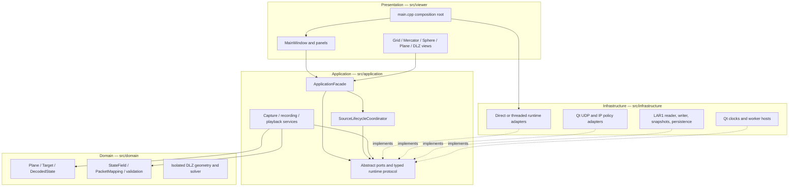
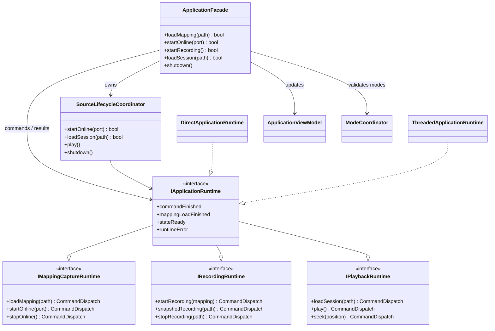
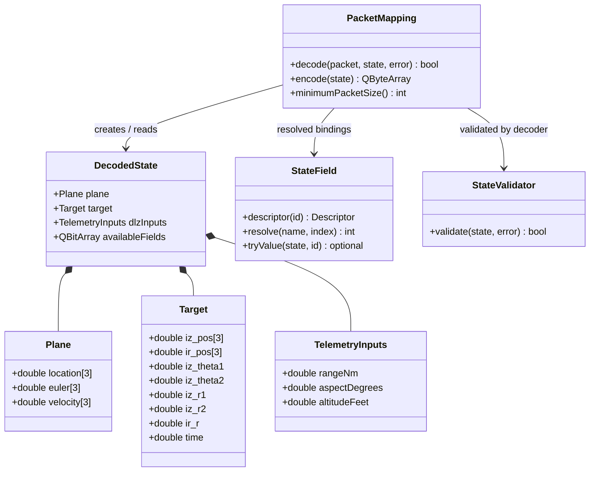
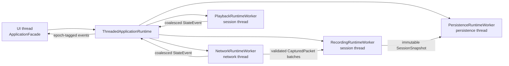
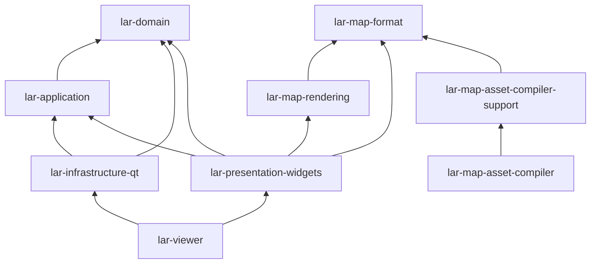

# Architecture

## Architectural style

LAR uses ports and adapters around a small domain and application core. Runtime
control flows from presentation to application interfaces; concrete networking,
filesystem, timers, and worker threads live in infrastructure. The viewer is
the composition boundary where those implementations are selected.

Solid arrows show compile-time use. Dashed arrows show implementation of an
inward-facing port. At runtime, signals and result values travel back out; that
does not reverse the source dependency.

## Layer rules

| Source area | Owns | May depend on | Must not depend on |
| --- | --- | --- | --- |
| `src/domain` | State values, field registry, mapping encode/decode, validation, DLZ calculations | C++ and Qt Core value types | Application, infrastructure, viewer, sockets, widgets, files, threads |
| `src/application` | Use cases, workflow state, ports, runtime protocol, view model | Domain and Qt Core abstractions | Infrastructure, viewer, Qt Network, Qt Widgets, OpenGL |
| `src/infrastructure` | Concrete mapping, UDP, clocks, session storage, workers, threaded runtime | Application ports, domain, Qt Core/Network | Viewer/presentation |
| `src/viewer` | Composition, widgets, dialogs, camera policy, map, Plane, and HUD rendering | Application, domain, infrastructure only at the composition root | Business persistence or transport policy |
| `tools/map_asset` | Build-time GeoJSON parsing, triangulation, mesh compilation, package writing | `lar-map-format`, Qt Core | Application runtime and presentation widgets |

`tools/check_architecture.py` enforces forbidden includes, concrete Qt leakage,
CMake link direction, and source-size ceilings. `tests/architecture_tests.cpp`
exercises substitutable adapters, command/result correlation, source epochs,
workflow transitions, and worker composition.

## Core class UML

The diagram intentionally shows architectural relationships, not every Qt
signal or helper. Generated Doxygen contains exhaustive inheritance and
collaboration diagrams.

## Domain and mapping model

`PacketMapping` owns an immutable, fully validated list of byte bindings and
the exact source JSON. `MappedPacketDecoder` first decodes a complete temporary
`DecodedState`, then `StateValidator` validates only fields marked available.
Callers never observe a partially updated frame.

## Runtime component graph

The session thread owns both recording and playback workers, but source
lifecycle policy prevents them from becoming simultaneous state publishers.
The persistence worker receives immutable snapshots, so slow disk I/O cannot
block UDP receive, recording append, playback, or the UI.

## Composition roots

- `src/viewer/main.cpp` constructs production UI-thread state,
  `ThreadedApplicationRuntime`, the IP-policy repository, the application
  facade, and `MainWindow`.
- `tests/support/architecture_test_support.h` composes the direct runtime with
  fakes for deterministic contract tests.
- `src/testsender/main.cpp` and `src/testsender/custom_sender.cpp` are separate
  executable roots; neither is linked into the viewer.
- `tools/map_asset/main.cpp` is the build-time map compiler root.

No application service selects a concrete adapter. Dependencies are supplied
through constructors or worker factories.

## CMake target graph

| Target | Important contents | Runtime role |
| --- | --- | --- |
| `lar-domain` | Packet-monitor and DLZ values/calculations | Pure core logic |
| `lar-application` | Ports, services, facade, direct runtime | Use cases and contracts |
| `lar-infrastructure-qt` | Qt adapters and threaded runtime | Production side effects |
| `lar-map-format` | Bounded `.larmap` format, reader, projection | Widget-free map boundary |
| `lar-map-rendering` | Camera, OpenGL renderer, map widget | GPU world-map presentation |
| `lar-presentation-widgets` | Main window, panels, LAR/Plane viewports, HUD | Qt Widgets presentation |
| `lar-viewer` | `main.cpp` and embedded UI resources | Installed desktop executable |
| `lar-map-asset-compiler-support` | GeoJSON reader and mesh compiler | Build-time only |

Although `lar-map-format` files live under `src/viewer/map`, the target is kept
free of QWidget/OpenGL dependencies so the build-time compiler and parser tests
can reuse it. `lar-map-rendering` contains the visual side of that subsystem.

## Stable boundaries and invariants

- Only `ApplicationFacade` mutates authoritative UI workflow state.
- `SourceLifecycleCoordinator` is the single owner of online/playback switching.
- A `RuntimeRequestId` correlates an accepted command with its completion.
- A `RuntimeSourceEpoch` rejects stale queued events from inactive generations.
- `DecodedState` publishes packet fields and their availability mask atomically.
- Recording persistence consumes immutable snapshots and commits atomically.
- UI dialogs return choices; they do not mutate application state themselves.
- Map compilation is a build dependency, never a viewer runtime dependency.
- Plane GLB/cubemap files are packaged data; the catalog groups complete
  six-face sets and bounded runtime readers commit complete CPU assets before
  the OpenGL context uploads them.
- The DLZ teaching model does not reinterpret the ground-LAR `Target` model.

See [Runtime data flows](DATA_FLOWS.md) and
[Concurrency model](CONCURRENCY_MODEL.md) for the temporal form of these
relationships.

## Safe extension points

| Change | Extend here | Avoid |
| --- | --- | --- |
| New packet field | `StateField` registry, mapping JSON, validation, view formatting | Offset-specific logic in UI or transport |
| New datagram transport | Implement `IDatagramSource` and inject it | Importing socket APIs into application |
| New mapping source | Implement `IMappingRepository` | Parsing JSON in a service or widget |
| New session storage | Implement transaction/reader/snapshot/persistence ports as needed | Downcasting `SessionSnapshot` |
| New playback clock | Implement `IPlaybackClock` | Wall-clock calls in `PlaybackService` |
| New viewport | Implement `ILarViewportPage`/`IEarthLarViewportPage` | Adding projection branches to application |
| New map package source | Implement `IMapAssetSource` | Filesystem lookup inside `EarthLarView` |
| New Plane model/skybox format | Extend the bounded reader/catalog under `src/viewer/plane` | Feeding unvalidated file sizes or counts to OpenGL |

Every extension must keep the dependency direction above and add a focused
contract test before it is wired into the production composition root.
