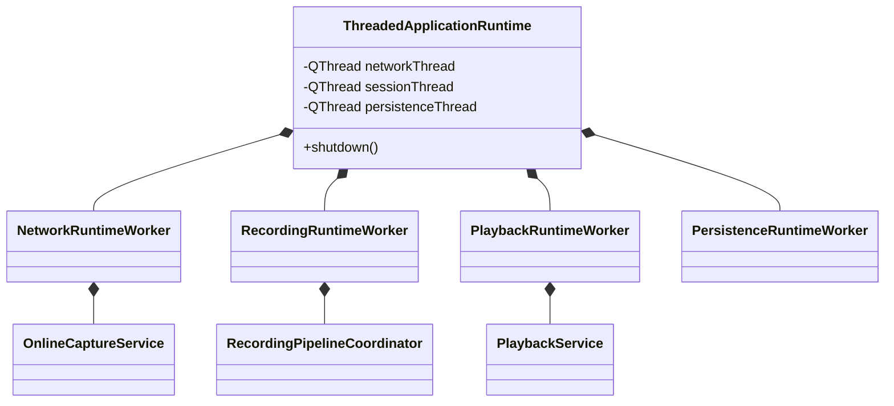
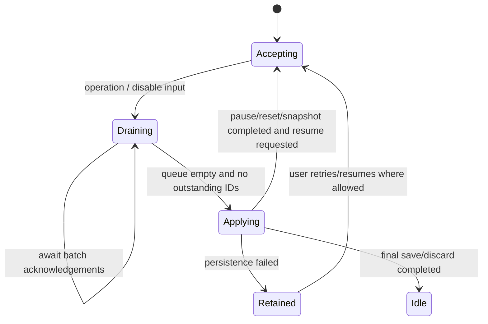

# Concurrency model

## Thread topology

The production application has four baseline execution threads. Qt's main
thread is not owned by the runtime; the runtime owns and joins the other three.
When DTED terrain is enabled, the Plane widget lazily starts and owns one
bounded terrain-preparation thread at a time. A validated session source change
stops that worker, invalidates stale revisions, and starts a replacement when
terrain remains visible.

| Thread | QObject/service owners | Work allowed |
| --- | --- | --- |
| UI / caller | `ApplicationFacade`, `SourceLifecycleCoordinator`, `ApplicationViewModel`, `MainWindow`, all widgets, `ThreadedApplicationRuntime` relay | User commands, lifecycle intent, accepted result filtering, presentation only |
| `lar-network-thread` | `NetworkRuntimeWorker`, `QtUdpDatagramSource`, `OnlineCaptureService`, online `MetricsService`, active decoder/repository | UDP receive, policy filter, mapping install, decode/validate, visual coalescing, recording batching |
| `lar-session-thread` | `RecordingRuntimeWorker`, `RecordingService`, `RecordingPipelineCoordinator`, `PlaybackRuntimeWorker`, `PlaybackService`, reader/clock/throttle/metrics | Recording append and barriers; session parse/sparse paging/decode; playback scheduling |
| `lar-persistence-thread` | `PersistenceRuntimeWorker`, `QtSessionPersistence` | Slow destination writes and atomic commit |
| `lar-plane-terrain-thread` (conditional) | `PlaneTerrainWorker`, `PlaneTerrainPatchBuilder`, DTED and water-mask samplers/caches | Bounded file parsing, class-aware bilinear sampling, normals, bathymetry, and latest-only immutable patch publication |

Recording and playback share the session thread so their mutable services are
serialized. `SourceLifecycleCoordinator` ensures only one is an active state
source. Destination persistence is separate because an immutable snapshot can
be safely handed off.
The optional terrain worker is presentation-owned, coalesces pending aircraft
positions, and performs no QWidget or OpenGL work. The UI/context thread alone
uploads and destroys terrain GPU resources.

## Ownership UML



Workers are detached from any factory parent, moved before their threads start,
and kept under explicit runtime ownership. Thread-affine collaborators are
created by each worker's `initialize()` slot after the thread starts. Timers are
QObject children rather than value members so the complete QObject tree follows
every affinity move.

## Command transport

All production commands cross from `ThreadedApplicationRuntime` to workers with
explicit `Qt::QueuedConnection`. Results return as registered, copyable value
types. No UI object is dereferenced by a worker.

The direct runtime is allowed to emit completion synchronously inside a command
call. `RequestResultGate<Result>` brackets dispatch so the facade handles this
case and queued delivery with the same observable semantics:

1. `beginDispatch()` opens a synchronous-completion buffer.
2. The runtime command returns `CommandDispatch`.
3. `finishDispatch()` validates acceptance and request identity.
4. A buffered matching result is returned immediately; otherwise its ID remains
   pending.
5. `receive()` accepts only the pending ID and discards invalid, stale, or
   duplicate results.

## Source generations

`RuntimeRequestId` correlates a finite command. `RuntimeSourceEpoch` identifies
a continuing producer activation:

```text
RuntimeSourceEpoch = { source: Online | Playback, generation: non-zero integer }
```

Starting online capture or loading playback allocates a new monotonically
increasing generation. Every state, metric, online-state, playback-position,
playback-state, and playback-finished event carries the epoch. The lifecycle
coordinator accepts an event only when both source and generation match its
active epoch.

This prevents:

- a stopped socket's queued final frame updating a loaded session;
- a closed session's timer event updating a restarted listener;
- an older activation of the same source updating a newer one;
- stale close/load completions changing current mode.

## Visual publication rates

Decode and recording are not throttled together with drawing:

- `OnlineCaptureService` emits every accepted `CapturedPacket` immediately for
  recording and metrics, but publishes only the latest `DecodedState` every
  16 ms.
- `PlaybackService` performs one logarithmic timestamp lookup per 60 Hz replay
  tick and decodes at most the selected record. It counts a record only when
  the displayed index changes.
- `PlaybackPublicationThrottle` emits only the latest sampled frame and
  position every 16 ms, so queued UI delivery remains bounded.

Consequently playback totals describe sampled record changes, not every stored
record crossed by a high replay rate or the number of viewport paints.

## Recording batching and bounds

The network worker batches accepted packets to reduce queued-signal overhead:

| Bound | Value |
| --- | ---: |
| Periodic flush interval | 2 ms |
| Maximum packets per batch | 2,048 |
| Maximum bytes per batch | 2 MiB |
| Maximum outstanding unacknowledged batches | 8 |
| Maximum buffered recording bytes | 32 MiB |

Every batch has a monotonically increasing ID. The recording worker acknowledges
the ID only after it has synchronously appended or deliberately ignored the
whole batch. Outstanding IDs provide an explicit drain condition.

If buffered bytes cross the limit, recording input is disabled and an error is
reported after already-issued batches drain. This is intentional backpressure:
the process sacrifices recording continuity rather than risk unbounded memory.

## Drain barrier

Pause, reset, snapshot, final save, and discard use a tokenized barrier:



The network worker records a process-wide monotonic boundary at drain start.
The recording service uses that boundary to close the active-time segment after
all pre-boundary packets are appended. Stale drain tokens are ignored.

For a snapshot, `preserveIncoming=true` routes post-boundary accepted packets
into a separate bounded buffer. After the immutable snapshot is handed to
persistence, the buffer is merged back in receipt order. Other operations drop
post-boundary recording input as required by their semantics; online display
capture remains independent unless final stop follows.

## Immutable persistence handoff

`LarSessionWriter::createSnapshot` captures a stable byte count and a shared
lifetime token for its temporary file. `FileSessionSnapshot` is const and can
only write that prefix to an already-open device. The persistence worker
therefore cannot race with later appends or temporary-file deletion.

`QtSessionPersistence` uses `QSaveFile`:

1. create a sibling temporary destination;
2. write the exact snapshot;
3. commit atomically;
4. leave an existing destination unchanged on any failure.

The session thread never waits for destination IO; completion returns by queued
signal with the persistence request ID.

## Asynchronous viewport preparation

`EarthMapLoadController` uses a future watcher and monotonically increasing
revision. A result is installable only for the current revision. Actual OpenGL
upload happens on the widget/context thread, then the widget reports installation
success back to the controller.

`EarthOverlayCoordinator` owns a separate preparation `QThread` local to an
Earth view. Requests carry revisions and use latest-only semantics. Prepared
meshes are copied back and installed on the render thread. Destruction stops and
joins this worker before its owning view disappears.

## Shutdown order

`ThreadedApplicationRuntime::shutdown()` is idempotent and executes this order:

1. Mark the runtime shutting down, clear its active source, and invalidate the
   next generation. New commands are rejected synchronously.
2. On each worker thread, use a blocking queued call to run the worker shutdown
   slot and move that worker's complete QObject tree to the runtime/UI thread
   while the source event loop is still alive.
3. Call `quit()` on all three threads.
4. `wait()` for all threads to finish.
5. Explicitly delete all four rehomed workers on the runtime affinity thread.

Worker shutdown slots stop timers, close sockets/readers, clear buffers, and
cancel mutable session work before event loops quit. No queued publication is
accepted after the application lifecycle enters `ShuttingDown`. Shutdown does
not use deferred `deleteLater` delivery after a worker event loop has exited. A
failed affinity move is a fail-stop invariant violation: the process terminates
instead of attempting an unsafe cross-affinity deletion in a release build.

## Concurrency invariants

- A QObject with worker affinity is only called through queued or blocking-
  queued delivery from another thread.
- Cross-thread arguments are registered Qt metatypes and copied or shared as
  immutable values.
- Mutable recording/session objects never cross their owning thread.
- Movable worker timers are parented QObject children, so they share worker
  affinity during startup and synchronous shutdown rehoming.
- The UI sees only epoch-tagged events accepted by the lifecycle owner.
- Buffer/count/time inputs are bounded before allocation or iteration.
- Slow filesystem destination IO is isolated behind immutable snapshots.
- Shutdown synchronously destroys every worker after joining every owned thread;
  destructors do not leave background work or pending deferred deletion.

The concurrency-specific evidence is in `larruntime-contract-tests`,
`larrecording-pipeline-tests`, `larsource-lifecycle-tests`,
`larviewport-worker-tests`, the repeated worker-destruction runtime test, the
TSan preset, and the operational soak test.
