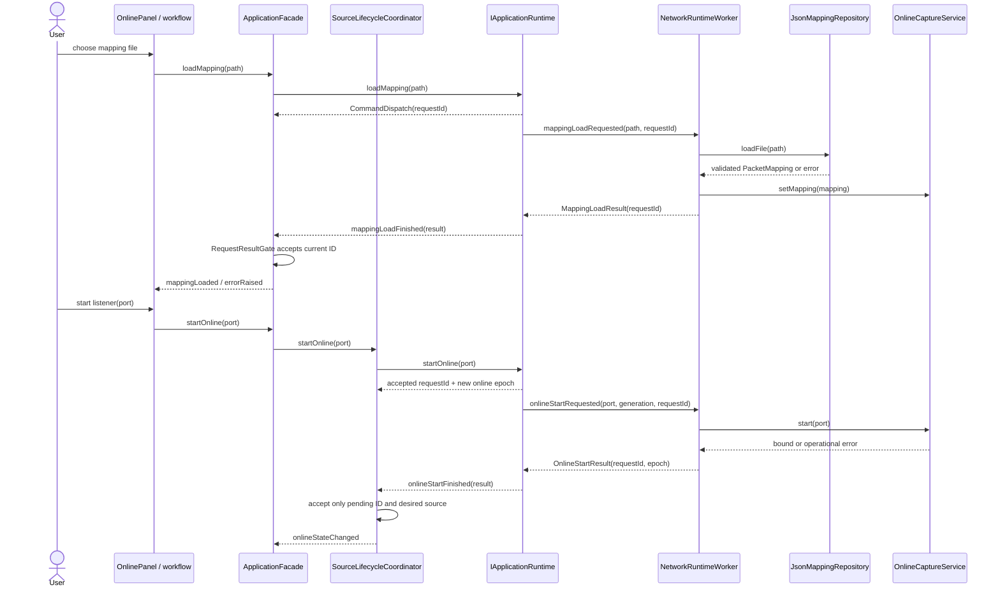
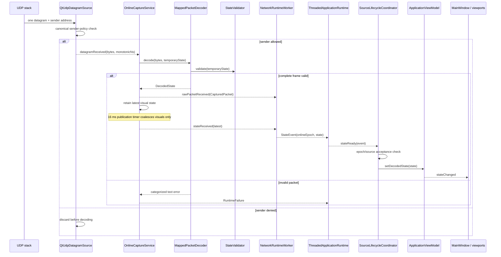
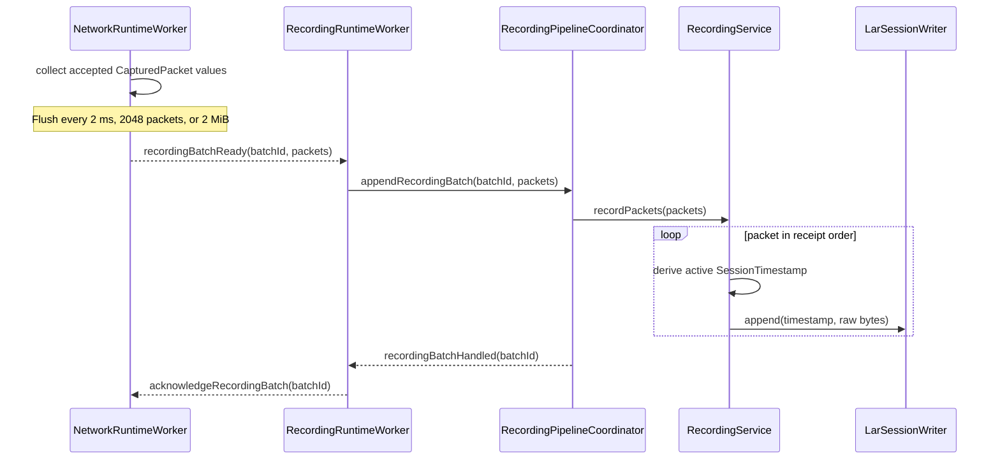
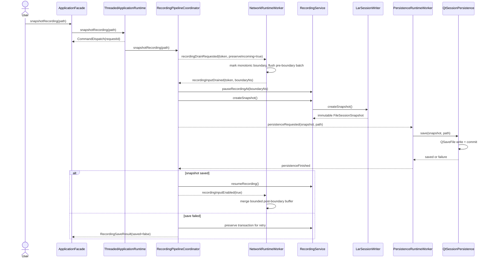
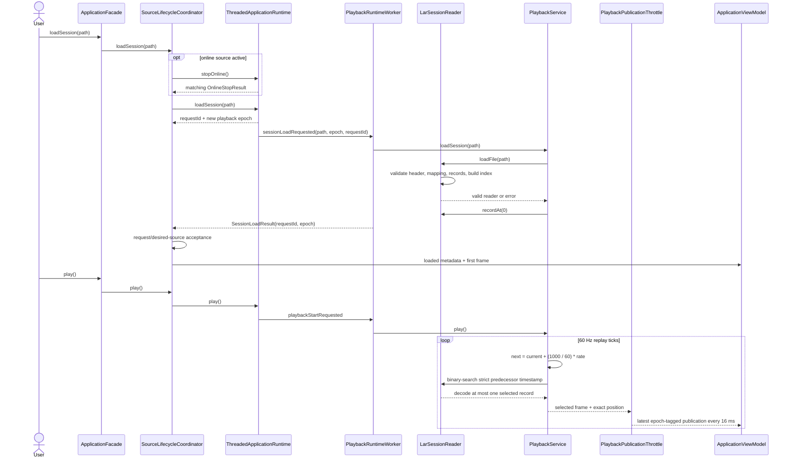
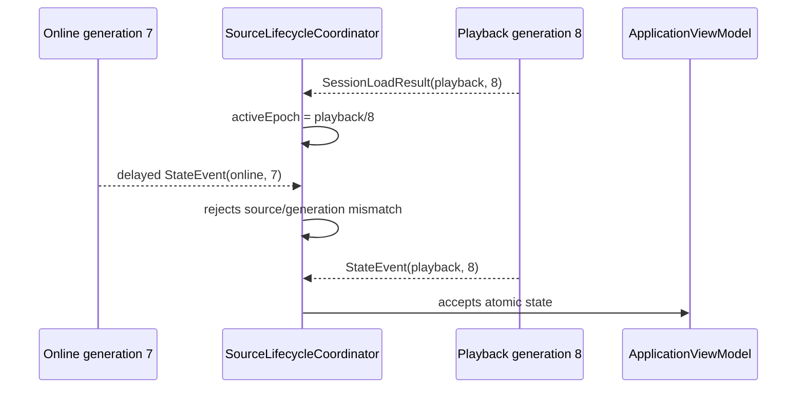
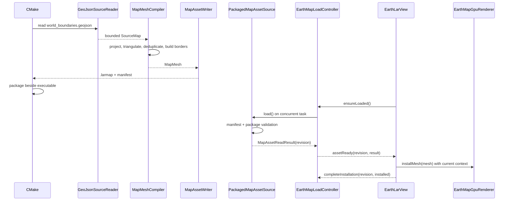
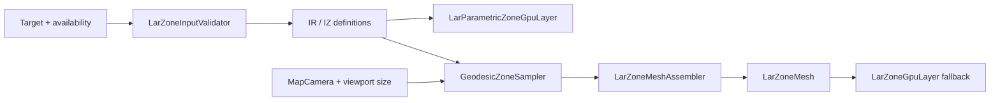
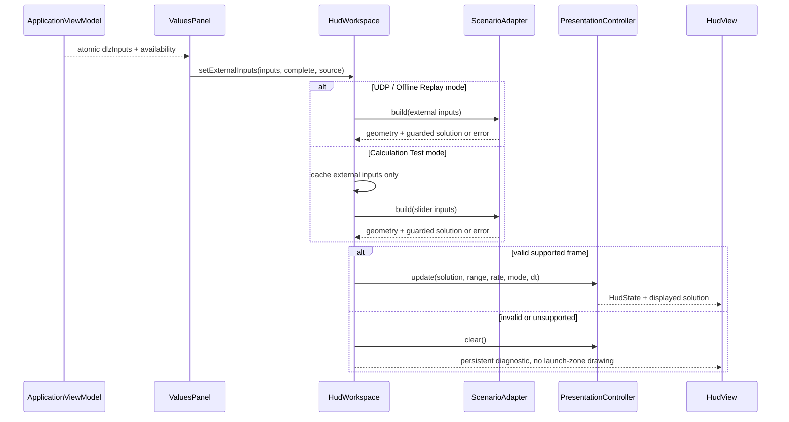

# Runtime data flows

These UML sequence diagrams show the main success paths and the guards that
change them. Error paths return through the same typed completion or
`RuntimeFailure` channel; output state is retained unless a complete operation
succeeds.

## Mapping installation and online activation

Mapping and policy replacement are rejected while capture is active. A failed
load leaves the previous mapping installed. A failed policy replacement leaves
the previous applied policy visible and active.

## Datagram acceptance and presentation

Every accepted raw packet remains eligible for recording even when visual
publication is coalesced. A rejected packet affects neither the view model nor
the recording transaction.

## Recording append and backpressure

At most eight batches are outstanding. The network side caps a batch at 2 MiB
and buffered recording input at 32 MiB. If the session side cannot keep up,
recording input pauses with a diagnostic rather than growing without bound.
UDP display processing can continue.

## Snapshot barrier

Snapshot, pause, reset, discard, and final save all use the same ordered drain
barrier. Snapshot differs because post-boundary accepted packets are retained
and recording resumes after the immutable prefix is captured.

For final save, `preserveIncoming` is false. Successful persistence completes
the transaction; the facade then completes the requested online stop. Failure
retains the transaction and existing destination for retry.

## Offline source transition and playback

Seek uses a binary search for the last timestamp at or before the requested
position. Normal replay does not decode intermediate records between sampled
positions. With Repeat enabled, the newly calculated cursor is reduced modulo
the final timestamp before every binary search, preserving any overshoot even
across multiple loops. Without Repeat, passing the final timestamp publishes
completion. The separate Burst widget is an inert placeholder and dispatches
no runtime command.

## Source epoch rejection

Queued Qt delivery means an old worker event can physically arrive after a new
source becomes active. Epoch checking makes this harmless.

Request IDs protect command completions; source epochs protect continuing
publications. They solve different races and both are required.

## Build-time and runtime map flow

The runtime never parses GeoJSON. Revisions prevent a late asynchronous result
from installing after invalidation or a newer request.

## LAR zone preparation and drawing

The parametric shader path is primary. The CPU worker path produces the same
bounded geodesic definitions for fallback and tests. Inputs are rejected before
allocation if fields, coordinates, radii, or counts violate central limits.

## DLZ input arbitration

Changing input mode never blends sources. The external triple is atomic: a
mapping with only one or two DLZ fields is invalid.
