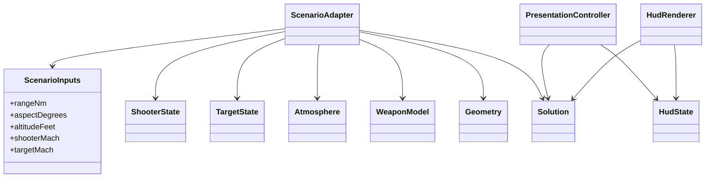

# Dynamic Launch Zone teaching model

The DLZ page is a deterministic visualization lab. Its equations are fictional,
public, and intentionally simple. They are not missile-performance data,
guidance logic, a certified aerospace model, or a flight simulator.

## Isolation boundary

`src/domain/dlz` owns the model. It does not reuse the ground-LAR `Target`
structure. Live UDP and replay carry only this atomic telemetry triple:

| Field | Unit | Protocol range |
| --- | --- | ---: |
| `dlz_range_nm` | nautical miles | 0.1–60 |
| `dlz_aspect_deg` | degrees | 0–180 |
| `dlz_altitude_ft` | feet | 0–60,000 |

`DecodedState` contains those values beside, not inside, the legacy
`Plane`/`Target` state. A mapping must contain all three fields or none.

## Domain values



The default model constants are:

| Parameter | Value |
| --- | ---: |
| Reference range | 32 nm |
| Reference altitude | 30,000 ft |
| Reference shooter Mach | 0.90 |
| Base minimum range | 1.8 nm |
| Average missile speed | 1,600 knots |
| Default atmosphere speed of sound | 340.294 m/s |
| UI/replay shooter Mach | 0.90 |
| UI/replay target Mach | 0.95 |

Reference altitude and Mach are retained in the explicit weapon value for model
description and validation; the current factor formulas use the numerical
30 kft datum and shooter Mach directly.

## Scenario adapter

The UI accepts range, aspect, and shooter altitude. `ScenarioAdapter` constructs
a deterministic local North-East-Down-style frame:

- shooter position is `(0, 0, -altitudeMetres)`;
- shooter attitude is zero and velocity points along positive X;
- target position is `rangeMetres` along positive X at equal altitude;
- target speed is `targetMach * speedOfSound`;
- target velocity direction is selected so its velocity versus the
  target-to-shooter line realizes the requested aspect exactly;
- target defensive loading is a fixed 9 g value.

The constructed frame is passed through the same general geometry function and
guarded solver used by tests. The adapter never partially replaces its output
with an invalid frame. For diagnostics, it does retain finite raw formula
values when the ordering guard rejects the scenario.

## Geometry

Let:

- `r = targetPosition - shooterPosition`;
- `vRel = targetVelocity - shooterVelocity`;
- `|r|` be slant range;
- `fwd` be the shooter's attitude-derived forward vector.

The derived values are:

```text
rangeNm       = |r| / 1852
rangeRateMps  = dot(r, vRel) / |r|
rangeRateKt   = rangeRateMps / 0.514444444444444
aspect        = acos(clamp(dot(targetVelocity, -r) /
                           (|targetVelocity| * |r|), -1, 1))
LOS azimuth   = atan2(r.y, r.x)
LOS elevation = atan2(-r.z, hypot(r.x, r.y))
offBoresight  = acos(clamp(dot(fwd, r) / |r|, -1, 1))
ATA           = offBoresight
altitudeDiffFt = -(target.z - shooter.z) * 3.280839895...
```

Positive range rate means separation is increasing; negative means closing.
Geometry rejects non-finite state, non-positive atmosphere/weapon values, zero
separation, and a stationary target (aspect would be undefined).

## Exact toy equations

For aspect `a` in radians, shooter altitude `h` in feet, and shooter Mach `M`:

```text
fAspect = 0.30 + 0.70 * (1 + cos(a)) / 2
fAlt    = clamp(1 + 0.020 * (h / 1000 - 30), 0.6, 1.6)
fMach   = 0.70 + 0.35 * M

RMAX = referenceRangeNm * fAspect * fAlt * fMach
RPI  = 0.83 * RMAX
RNE  = RMAX * (0.44 * fAspect + 0.08)
RTR  = 0.60 * RNE
RMIN = baseMinimumRangeNm

timeOfFlightSeconds = currentRangeNm / averageMissileSpeedKnots * 3600
inEnvelope = currentRangeNm > RMIN and currentRangeNm <= RPI
shootCue   = inEnvelope
```

The aspect factor is 1.0 head-on (`0°`) and 0.30 tail-on (`180°`). The altitude
factor changes by 0.02 per thousand feet around 30 kft, clamped to 0.6–1.6.

## Supported ordered domain

The renderer accepts a solution only when every value is finite and:

```text
RMIN < RTR < RNE < RPI < RMAX
```

`supportsOrdering` validates aspect `0..pi`, non-negative altitude/Mach, and
positive finite weapon constants, then rejects a domain where `RTR <= RMIN`.
`solve` additionally validates every shooter, target, atmosphere, geometry, and
weapon value.

| `DlzSolveError` | Meaning |
| --- | --- |
| `None` | Complete ordered solution is available |
| `InvalidInput` | A required scalar/vector is non-finite or violates sign/range rules |
| `UnsupportedOrderedDomain` | Exact formulas cannot maintain `RMIN < RTR` for this input |
| `NumericOverflow` | A factor or output exceeded the finite numeric domain |
| `InvalidDerivedOrdering` | Finite output still failed the complete strict order |

`evaluateToyModel` intentionally skips the ordering guard. It exists only to
keep diagnostic readouts transparent. Its output must not be rendered as a
valid launch-zone solution.

## Input modes

The DLZ values panel exposes exactly two sources:

- **UDP / Offline Replay** uses the most recent complete mapped triple. It has
  no sliders. Online/replay source switching is inherited from the application
  lifecycle.
- **Calculation Test** uses only local range/aspect/altitude sliders. Incoming
  external triples are cached so switching back is immediate, but they cannot
  mutate the current drawing or its filter/cue state.

Switching source or editing a local calculation resets temporal presentation.
Sequential external samples retain filter, scale hysteresis, and cue timing.
Missing or invalid external input clears the frame.

## Presentation state

`PresentationController` converts a valid solution into stable HUD behavior:

### Range filter

The first sample is displayed exactly. Later samples use:

```text
dt = clamp(dtSeconds, 0, 0.25)
gain = clamp(dt / 0.25, 0, 1)
displayed += (raw - displayed) * gain
```

This is a bounded first-order filter with a nominal 0.25-second time constant.

### Scale hysteresis

Available maximums are `10`, `20`, `40`, and `80` nm. Initial scale is the
smallest step containing `max(currentRange, RMAX)`, capped at 80 nm.

- a rising decision range moves up only when it crosses 90% of the current
  scale;
- a falling range moves down only when it crosses below 60% of the current
  scale;
- a range above 80 nm parks the caret at the top while preserving the raw
  readout.

### Shoot cue hysteresis

The cue enters only when the solver cue is true and raw range is more than
`0.10 nm` above RMIN and `0.20 nm` below RPI. It exits at `0.10 nm` below RMIN
or `0.20 nm` above RPI, but remains active for at least `0.50 s` after entry.
The visible word flashes on the first half of a `0.50 s` period.

### Rendering

`HudRenderer` is stateless. It draws only finite `Prelaunch` state with a valid
scale. It renders:

- the vertical range axis and RMAX/RPI/RNE/RMIN ticks;
- an amber RNE-to-RMIN band;
- a filtered current-range caret and text;
- scale text and the flashing `SHOOT` cue.

Any invalid state draws `NO TRACK` or a persistent error rather than stale or
unordered symbology.

## Verification

- `tests/dlz_tests.cpp`: geometry, factors, ordering errors, filtering, scale,
  and cue timing.
- `tests/dlz_view_tests.cpp`: controls, source isolation, diagnostics, workspace,
  and deterministic fixtures.
- `tests/fuzz/dlz_solver_fuzz.cpp`: arbitrary finite/non-finite inputs and
  value-or-error invariants.
- `src/testsender/scenarios.cpp`: named UDP/replay inputs such as head-on, beam,
  tail-chase, minimum, far, and aspect sweep.

Run:

```bash
cmake --build build-release --target lardlz-tests lardlz-view-tests
ctest --test-dir build-release --output-on-failure -R 'lardlz'
```
