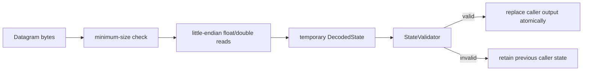

# Packet protocol and units

The UDP protocol is schema-driven. A JSON mapping binds packet byte ranges to
the fixed scalar registry in `StateField`; packets do not contain field names,
units, version bytes, or record framing.

## Mapping entry

```json
{
  "name": "location",
  "index": 0,
  "offset": 8,
  "size": 8
}
```

| Property | Contract |
| --- | --- |
| `name` | Exact registry mapping name; case-sensitive |
| `index` | Exact integer array index, or `0` for a scalar |
| `offset` | Non-negative integer byte offset from the datagram start |
| `size` | `4` for IEEE-754 binary32 or `8` for IEEE-754 binary64 |
| byte order | Little-endian for both widths |

The mapping root must be a non-empty array of objects. Mapping JSON and the
resulting minimum packet size are each capped at 16 MiB. A field may occur only
once and byte ranges may not overlap. Array order is irrelevant. Unmapped gaps
are permitted; `PacketMapping::encode` fills them with zero. A received packet
may contain trailing bytes beyond `minimumPacketSize()` and those raw bytes are
preserved when recorded.

## Canonical fields

The ID order below is also the `QBitArray` availability-bit order.

| ID | Mapping key | Domain member | Presentation label | Unit | Scalar validation |
| ---: | --- | --- | --- | --- | --- |
| 0 | `location`, `0` | `Plane.location[0]` | Latitude | radians | finite, `[-pi/2, pi/2]` |
| 1 | `location`, `1` | `Plane.location[1]` | Longitude | radians | finite, `[-pi, pi]` |
| 2 | `location`, `2` | `Plane.location[2]` | Altitude | metres | finite |
| 3 | `euler`, `0` | `Plane.euler[0]` | Heading (Yaw) | radians | finite |
| 4 | `euler`, `1` | `Plane.euler[1]` | Pitch | radians | finite |
| 5 | `euler`, `2` | `Plane.euler[2]` | Roll | radians | finite |
| 6 | `velocity`, `0` | `Plane.velocity[0]` | X Axis | kilometres/hour | finite |
| 7 | `velocity`, `1` | `Plane.velocity[1]` | Y Axis | kilometres/hour | finite |
| 8 | `velocity`, `2` | `Plane.velocity[2]` | Z Axis | kilometres/hour | finite |
| 9 | `iz_pos`, `0` | `Target.iz_pos[0]` | Latitude | radians | finite, `[-pi/2, pi/2]` |
| 10 | `iz_pos`, `1` | `Target.iz_pos[1]` | Longitude | radians | finite, `[-pi, pi]` |
| 11 | `iz_pos`, `2` | `Target.iz_pos[2]` | Radius | metres | finite |
| 12 | `ir_pos`, `0` | `Target.ir_pos[0]` | Latitude | radians | finite, `[-pi/2, pi/2]` |
| 13 | `ir_pos`, `1` | `Target.ir_pos[1]` | Longitude | radians | finite, `[-pi, pi]` |
| 14 | `ir_pos`, `2` | `Target.ir_pos[2]` | Radius | metres | finite |
| 15 | `iz_theta1`, `0` | `Target.iz_theta1` | Start Angle | radians | finite |
| 16 | `iz_theta2`, `0` | `Target.iz_theta2` | End Angle | radians | finite |
| 17 | `iz_r1`, `0` | `Target.iz_r1` | Minimum Range | metres | finite, non-negative |
| 18 | `iz_r2`, `0` | `Target.iz_r2` | Maximum Range | metres | finite, positive |
| 19 | `ir_r`, `0` | `Target.ir_r` | Maximum Range | metres | finite, positive |
| 20 | `time`, `0` | `Target.time` | Timestamp | seconds | finite |
| 21 | `dlz_range_nm`, `0` | `DLZ.range_nm` | Range | nautical miles | finite, `[0.1, 60]` |
| 22 | `dlz_aspect_deg`, `0` | `DLZ.aspect_deg` | Aspect | degrees | finite, `[0, 180]` |
| 23 | `dlz_altitude_ft`, `0` | `DLZ.altitude_ft` | Altitude | feet | finite, `[0, 60000]` |

The legacy cross-field rule is applied only when both fields are mapped:

```text
Target.iz_r1 < Target.iz_r2
```

The three DLZ fields are atomic at schema level. A mapping may contain none of
them or all three; one- or two-field DLZ mappings are rejected. This prevents a
frame from combining current and stale DLZ values.

## Position and angle conventions

- Latitude is positive north and constrained to `[-pi/2, pi/2]`.
- Longitude is positive east and constrained to `[-pi, pi]`.
- `Plane.location[2]` is altitude above the model datum in metres.
- `Target.iz_pos[2]` and `Target.ir_pos[2]` are protocol radius components in
  metres. Geographic drawing uses latitude/longitude plus the explicit IR/IZ
  range fields; it does not reinterpret these components as altitude.
- `Plane.euler[0]` is heading/yaw, `[1]` pitch, `[2]` roll. They must be finite
  but are not normalized by the decoder.
- IZ start/end angles must be finite. Zone normalization determines directed
  span and full-circle behavior for rendering.
- Velocity components use kilometres per hour. Geographic sender scenarios
  may derive them from metre/second formulas and multiply by `3.6`.

The receiver validates protocol/domain bounds, not physical plausibility.
Finite but unusually large altitude, velocity, attitude, position-radius, IZ
angle, or producer-time values can remain valid if no tighter rule is listed.
Rendering applies its own resource limits before geometry allocation.

## Availability semantics

`DecodedState::availableFields` has `StateField::Count` bits. A set bit means
the active mapping supplied and the decoder validated that scalar. Unmapped
storage in `Plane`, `Target`, or `TelemetryInputs` remains default-initialized
but must not be treated as measured data.

Consumers follow these rules:

- Current Values displays `N/A` for an unavailable field.
- A LAR geometry is drawn only when all fields needed by that geometry are
  available and pass view-specific resource checks.
- Camera follow/fit logic ignores unavailable coordinates.
- The DLZ external input source is available only when all three bits are set.
- Availability is stored implicitly through the embedded mapping in a `.lar`
  session and recreated on replay.

## Decode transaction



`size: 4` values are promoted to `double` after decoding, so they retain only
binary32 precision. `size: 8` preserves the in-memory binary64 representation.

## Supplied mappings

- `maps/full-state.json`: all 21 Plane/Target fields, deliberately reordered.
- `maps/dlz-inputs.json`: only the complete DLZ triple.
- `maps/full-state-dlz.json`: all legacy fields plus the complete DLZ triple.

Sender and viewer must use the same mapping for live UDP. Offline playback
always uses the canonical mapping embedded in the session and ignores any
separately loaded online mapping.
