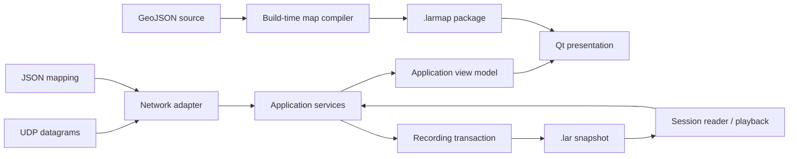

# LAR Packet Monitor documentation

This is the technical reference for the current C++17/Qt 6 implementation. It
describes the architecture, runtime behavior, data formats, and public API.

## Start here

| Document | Use it for |
| --- | --- |
| [Project specification](../ProjectSpecification.md) | Product scope, maintained requirements, constraints, and acceptance criteria |
| [Architecture](ARCHITECTURE.md) | Layer boundaries, component and class UML, CMake targets, and dependency rules |
| [Component/API reference](COMPONENT_REFERENCE.md) | Responsibilities, public entry points, and collaborators for production types |
| [Runtime data flows](DATA_FLOWS.md) | Online, recording, playback, map, and DLZ sequence diagrams |
| [Concurrency model](CONCURRENCY_MODEL.md) | Thread ownership, queued messages, request IDs, epochs, drains, and shutdown |
| [Protocol units](PROTOCOL_UNITS.md) | Exact packet field names, physical units, availability, and validation |
| [LAR1 session format](LAR1_FORMAT.md) | Binary layout, limits, validation, snapshots, and compatibility |
| [DLZ model](DLZ_MODEL.md) | Isolated teaching-model inputs, equations, supported domain, and UI state |
| [Threat model](THREAT_MODEL.md) | Assets, trust boundaries, attack surfaces, resource budgets, residual risks, and review triggers |
| [Developer guide](DEVELOPER_GUIDE.md) | Build/change workflows and required design checks |
| [Quality gates](QUALITY_GATES.md) | Strict, sanitizer, GPU, documentation, install, and dependency evidence |

## System at a glance



The dependency rule is deliberately different from the runtime flow:

```text
viewer/presentation -> application -> domain
infrastructure ------> application -> domain
tools/map_asset --------------------> map-format boundary
```

Runtime data may flow in both directions through abstract ports and Qt signals;
source-code dependencies always point inward. See
[Architecture](ARCHITECTURE.md) for the exact graph.

## API documentation

Every maintained production header has an `@file`/`@brief` block. Public
contracts and non-obvious invariants are documented beside their declarations;
redundant generated method narration is rejected by `check-doc-quality`.
Doxygen also extracts the complete symbol surface and Graphviz collaboration,
inheritance, include, and directory diagrams.
