# SOLID compliance

This document records the current SOLID design and the checks that protect it.
SOLID is treated as a set of change-safety constraints, not a requirement to
create an interface for every class.

## Compliance summary

| Principle | Current implementation | Evidence and regression guard |
| --- | --- | --- |
| Single Responsibility | Mapping, validation, lifecycle, capture, recording time, drain/persistence policy, playback, UI workflow, terrain preparation, rendering, and storage have distinct owners | Focused classes, CMake targets, file-size gate, service/unit tests |
| Open/Closed | Transport, mapping, clocks, session IO, snapshots, runtime, dialogs, viewport pages, and map sources are replaceable behind contracts | Port interfaces, injected fakes, direct and threaded runtime implementations |
| Liskov Substitution | Implementations obey explicit output, failure, idempotence, ownership, and atomicity contracts | Adapter tests, runtime contract tests, session tests, architecture fakes |
| Interface Segregation | Runtime commands are split into mapping/capture, recording, playback, metrics, and lifetime slices; lower-level ports are use-case-specific | `I*Runtime` slices and focused `IDatagramSource`, `ISessionReader`, etc. |
| Dependency Inversion | Application code owns ports; concrete Qt adapters depend inward; production selection occurs in `main.cpp`/worker factories | Include/link architecture gate and constructor injection |

## Single Responsibility Principle

The major responsibilities and their single owners are:

| Responsibility | Owner |
| --- | --- |
| Scalar packet-field identity and access | `StateField` |
| Immutable packet byte mapping | `PacketMapping` |
| Semantic state validation | `StateValidator` |
| Top-level mode legality | `ModeCoordinator` |
| Online/playback source switching and stale-event rejection | `SourceLifecycleCoordinator` |
| Presentation command surface and result gating | `ApplicationFacade` |
| Datagram decode/coalescing | `OnlineCaptureService` |
| Packet/record rate accounting | `MetricsService` and playback-specific `PlaybackMetrics` |
| Recording active-time calculation | `RecordingService` |
| Recording drain/snapshot/persistence sequencing | `RecordingPipelineCoordinator` |
| Indexed playback policy | `PlaybackService` |
| Concrete thread wiring | `ThreadedApplicationRuntime` |
| Session bytes | `LarSessionWriter` and `LarSessionReader` |
| Atomic destination replacement | `QtSessionPersistence` |
| File-choice policy | Workflow controllers and dialog ports |
| Geographic sample generation | `GeodesicZoneSampler` |
| GPU index assembly | `LarZoneMeshAssembler` |
| Map package parsing | `MapAssetReader` |
| Indexed vector land classification | `MapLandIndex` |
| DTED cell parsing/path lookup/mosaic cache | `DtedCellReader`, `DtedTileSource`, `DtedMosaicSampler` |
| Local land-mask rasterization | `PlaneLandMaskBuilder` |
| Latest-only terrain preparation | `PlaneTerrainWorker` and `PlaneTerrainPatchBuilder` |
| OpenGL drawing | GPU layer/renderer classes |

The architecture checker caps selected orchestration files and every production
`.cpp` file. A growing coordinator should be split by responsibility before a
limit is raised.

## Open/Closed Principle

The application core is extended through these stable seams:

```mermaid
classDiagram
    class IDatagramSource { <<interface>> }
    class IMappingRepository { <<interface>> }
    class IPacketDecoder { <<interface>> }
    class IRecordingClock { <<interface>> }
    class IRecordingTransaction { <<interface>> }
    class ISessionSnapshot { <<interface>> }
    class ISessionPersistence { <<interface>> }
    class ISessionReader { <<interface>> }
    class IPlaybackClock { <<interface>> }
    class IMapAssetSource { <<interface>> }
    class ILarViewportPage { <<interface>> }

    class QtUdpDatagramSource
    class JsonMappingRepository
    class MappedPacketDecoder
    class QtRecordingClock
    class LarSessionWriter
    class FileSessionSnapshot
    class QtSessionPersistence
    class LarSessionReader
    class QtPlaybackClock
    class PackagedMapAssetSource
    class GridLarView
    class EarthLarView

    QtUdpDatagramSource ..|> IDatagramSource
    JsonMappingRepository ..|> IMappingRepository
    MappedPacketDecoder ..|> IPacketDecoder
    QtRecordingClock ..|> IRecordingClock
    LarSessionWriter ..|> IRecordingTransaction
    FileSessionSnapshot ..|> ISessionSnapshot
    QtSessionPersistence ..|> ISessionPersistence
    LarSessionReader ..|> ISessionReader
    QtPlaybackClock ..|> IPlaybackClock
    PackagedMapAssetSource ..|> IMapAssetSource
    GridLarView ..|> ILarViewportPage
    EarthLarView ..|> ILarViewportPage
```



Adding a new implementation should not require changing the consuming service.
Wiring changes belong in a composition root. Domain changes that introduce new
meaning—such as a new packet field—appropriately modify the field registry and
validation because that is a change to the domain contract, not merely a new
implementation.

## Liskov Substitution Principle

Substitutability depends on behavioral contracts, not only matching method
signatures. Implementations must preserve these rules:

- Repository and decode outputs are replaced only after complete success.
- `IDatagramSource::stop()` and runtime shutdown are safe when repeated.
- An accepted runtime command has a non-zero request ID and exactly one matching
  typed completion; a rejected command has neither.
- Runtime implementations may complete synchronously or asynchronously without
  changing observable application behavior.
- `ISessionReader` exposes only fully validated sessions; its Qt adapter uses
  sparse checkpoints and one bounded location page rather than a per-record
  memory index.
- `IRecordingTransaction` timestamps are non-decreasing and snapshots are
  immutable after publication.
- `ISessionPersistence` either commits the complete snapshot or preserves the
  previous destination.
- `IPlaybackClock` supplies ticks; the replay service owns exact fixed-step time
  and does not depend on `QTimer` or wall-clock details.
- `IMapAssetSource` returns the same categorized read result regardless of where
  package bytes originate.
- Dialog cancellation is represented by an empty result and has no side effect.

`DirectApplicationRuntime` and `ThreadedApplicationRuntime` are the principal
LSP pair. `tests/runtime_contract_tests.cpp` and
`tests/architecture_tests.cpp` run the same command/result expectations against
injected and production-style compositions.

## Interface Segregation Principle

`IApplicationRuntime` is a QObject event boundary, but command capabilities are
split so focused consumers and fakes can depend on narrow interfaces:

- `IMappingCaptureRuntime`
- `IRecordingRuntime`
- `IPlaybackRuntime`
- `IMetricsRuntime`
- `IApplicationLifetime`

Lower-level ports are also separated by use case. For example, session mutation
(`IRecordingTransaction`), immutable transfer (`ISessionSnapshot`), atomic
destination IO (`ISessionPersistence`), and random-access playback
(`ISessionReader`) are four contracts. An implementation never has to depend on
methods it cannot sensibly support.

Do not merge these interfaces merely because one production class implements
several of them. Conversely, do not introduce a new interface when a value type
or pure function already provides the needed seam.

That second rule is important in the Plane pipeline: `MapLandIndex`,
`DtedMosaicSampler`, and immutable terrain-patch values are focused concrete
presentation helpers. They do not need application-layer ports because they do
not represent external business side effects or cross the application boundary.

## Dependency Inversion Principle

Application services refer to application-owned abstractions:

```text
OnlineCaptureService  -> IDatagramSource + IPacketDecoder
RecordingService      -> IRecordingTransaction + IRecordingClock
PlaybackService       -> ISessionReader + IPlaybackClock
IpAccessPolicyService -> IIpAccessPolicyRepository
ApplicationFacade     -> IApplicationRuntime
```

Concrete Qt types point inward:

```text
QtUdpDatagramSource       -> IDatagramSource
JsonMappingRepository     -> IMappingRepository
LarSessionWriter          -> IRecordingTransaction
QtSessionPersistence      -> ISessionPersistence
ThreadedApplicationRuntime -> IApplicationRuntime
```

The application target links only `lar-domain` and Qt Core. It cannot link Qt
Network, Widgets, OpenGL, infrastructure, or presentation. The source checker
also rejects forbidden includes, so accidental concrete construction fails the
repository gate before review.

## Mechanical protection

Run the focused SOLID boundary evidence:

```bash
python3 tools/check_architecture.py .
cmake --build build-release --target lararchitecture-tests \
  larruntime-contract-tests larsource-lifecycle-tests \
  larrecording-pipeline-tests larsession-adapter-tests
ctest --test-dir build-release --output-on-failure \
  -R 'architecture|runtime-contract|source-lifecycle|recording-pipeline|session-adapter'
```

The source gate checks:

- inward-only layer includes;
- absence of concrete network/widget/file/thread APIs in application code;
- inward-only CMake target links;
- build-time map tooling remains outside the viewer runtime graph;
- bounded coordinator/source size.

The executable tests check:

- illegal modes are rejected without corrupting state;
- injected datagram, decoder, clock, transaction, snapshot, persistence, and
  reader substitutes honor their ports;
- direct and threaded runtime completion semantics match;
- source generations reject inactive and stale publications;
- recording drains and immutable persistence preserve packet ordering;
- failed policy or save replacement retains the previous valid state/data.

## Review checklist for structural changes

Before merging a refactor, answer all of these with code or test evidence:

1. Does each changed class still have one reason to change?
2. Can a new implementation be added at the intended seam without editing its
   consumer?
3. Do new adapters preserve failure, ownership, atomicity, and idempotence
   contracts?
4. Did any consumer gain methods it does not need?
5. Does every source and CMake dependency still point inward?
6. Is concrete construction confined to a composition root or worker factory?
7. Do architecture and runtime contract tests cover the new behavior?

If a change requires crossing a rule, update this document and the mechanical
gate in the same review. A local convenience is not enough reason to weaken the
boundary.
