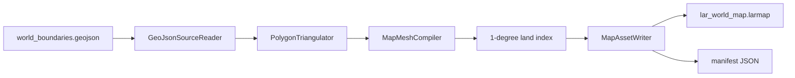

# Terrain and asset pipeline

## Overview

The visual asset path has four distinct inputs:

| Input | When processed | Runtime result |
| --- | --- | --- |
| Natural Earth GeoJSON | Build time | Versioned `.larmap` mesh and manifest |
| DTED Level 0/1/2 cells | On demand in Plane terrain worker | Immutable local elevation patch |
| glTF/GLB aircraft model | Startup or user selection | Immutable normalized mesh and decoded textures |
| Six-face cubemap PNG set | Startup and selection | Validated skybox images |

The build-time map compiler is not linked into the viewer. Runtime readers
accept bounded binary/package data and publish a candidate only after complete
validation.

## Source asset tree

| Path | Purpose | Distribution behavior |
| --- | --- | --- |
| `assets/map/world_boundaries.geojson` | Natural Earth Admin-0 polygon source | Build input only |
| `assets/models/f16_3.glb` | Default Plane model | Copied beside rendering executables and installed |
| `assets/cubemaps/*.png` | Packaged skyboxes | Copied and installed |
| `assets/DTED0` | Development DT0 root | Read in place; not copied or installed by default |
| `assets/ui/icons/icons.qrc` | Icons and stylesheet | Embedded as Qt resources |

The [asset inventory](../assets/README.md) records packaging and attribution.
The map source attribution is in
[assets/map/README.md](../assets/map/README.md).

## World-map compilation



The `lar-map-asset` target runs this pipeline as a dependency of every target
that needs the packaged map. The GeoJSON parser accepts polygon and
multipolygon input under explicit bounds:

| Resource | Limit |
| --- | ---: |
| Source bytes | 64 MiB |
| Features | 2,000 |
| Polygons | 20,000 |
| Rings | 50,000 |
| Coordinates in one ring | 1,000,000 |
| Coordinates in the source | 1,500,000 |

The triangulator removes unsafe degeneracy, normalizes winding, unwraps
antimeridian-crossing rings, bridges holes, and applies planar ear clipping.
An unbridgeable hole or unsafe polygon fails the compilation; it is not emitted
as partial geometry.

## LRM1 map package

The current package is **LRM1 version 2**. All scalar fields are little-endian.
Its fixed 80-byte header stores:

- magic, version, header size, flags, and a reserved zero field;
- vertex count;
- Mercator-fill, sphere-fill, and border-index counts;
- land-cell and land-triangle-reference counts;
- payload byte count and IEEE CRC-32.

The payload is the tight concatenation of:

1. float vertex triplets `(longitude degrees, latitude degrees, Mercator y)`;
2. Mercator triangle indices;
3. sphere triangle indices;
4. border line-pair indices;
5. 360 × 180 one-degree land-cell ranges;
6. land triangle ordinals referenced by those ranges.

The package reader checks exact file size, CRC, supported flags, checked byte
arithmetic, finite coordinate bounds, index ranges, and land-index range
consistency before returning a `MapMesh`. The total file limit is 64 MiB.
Geometry limits include 2,000,000 vertices, 6,000,000 indices for each fill
projection, 4,000,000 border indices, and 4,000,000 land-triangle references.

`PackagedMapAssetSource` also validates the adjacent manifest and caches the
first load result. Mercator, Sphere, and Plane terrain receive the same
immutable mesh.

## Geographic land index

`MapMeshCompiler` assigns each Mercator fill triangle to every one-degree
cell touched by its geographic bounds. `MapLandIndex` uses those ranges to:

- answer a bounded point-in-land query;
- collect candidate triangles for an unwrapped geographic rectangle;
- handle longitude wrapping without scanning the complete world mesh.

This index is the common land/sea authority for Earth and Plane. DTED elevation
sign is not land classification: below-sea-level land such as the Dead Sea must
remain land, and an ocean post must remain water even if its encoded elevation
is unexpected.

## DTED source selection

Plane starts with Level 0 and resolves its root in this order:

1. `LAR_DTED0_ROOT` environment variable;
2. `assets/DTED0` beside the executable;
3. the CMake `LAR_DTED0_ROOT` development path compiled into
   `lar-presentation-widgets`.

The source tree is intentionally not scanned at startup. A coordinate maps
directly to a degree-aligned conventional path:

```text
e035/n39.dt0
w123/n48.dt1
e151/s34.dt2
```

Path resolution tries lower- and upper-case variants, requires a regular file,
and verifies canonical containment below the selected root.

The Plane upload workflow accepts Level 1 or Level 2. It scans at most 1,024
immediate longitude directories and 512 candidate files while looking for one
valid addressed tile. A candidate source becomes active only after that tile
passes the full reader. Cancellation or failure retains the old dataset and
patch.

## Supported DTED levels

| Level | Latitude posts | Latitude interval | Nominal spacing used for patch policy | Suffix |
| ---: | ---: | ---: | ---: | --- |
| 0 | 121 | 30 arc-seconds | 900 m | `.dt0` |
| 1 | 1,201 | 3 arc-seconds | 90 m | `.dt1` |
| 2 | 3,601 | 1 arc-second | 30 m | `.dt2` |

Longitude profile counts can be smaller near the poles. Supported longitude
interval multipliers are 1, 2, 3, 4, and 6, and the declared posts must still
span exactly one degree.

## DTED validation

`DtedCellReader` streams one file and validates before publishing:

- the level-specific maximum file size;
- complete UHL, DSI, and ACC headers;
- numeric origin, interval, and dimension fields;
- a degree-boundary origin in the WGS84 tile range;
- exact file length derived from profile count;
- the `0xAA` profile sentinel;
- every big-endian profile checksum;
- signed-magnitude elevations and the `-32767` no-data sentinel.

A limited compatibility branch recognizes physically impossible
signed-magnitude values as two's-complement negative data. A parsed cell remains
immutable and records its actual longitude/latitude spacing.

## Mosaic sampling and cache

`DtedMosaicSampler`:

- loads only the cell addressed by the requested WGS84 coordinate;
- caches successful and failed lookups;
- bilinearly interpolates the four surrounding posts;
- ignores no-data posts and renormalizes the remaining weights;
- preserves signed elevation, including negative bathymetry;
- evicts least-recently-used entries.

The default cache is bounded by both **24 entries** and **128 MiB** of decoded
elevation storage. A single currently addressed tile may exceed the byte budget
without being immediately evicted; subsequent entries force eviction.

Land/water classification is deliberately outside the sampler. It depends on
the shared vector map, not the DTED value.

## Local land mask

For each requested patch, `PlaneLandMaskBuilder`:

1. converts the local patch corners back to geography with the same inverse
   projection used for terrain samples;
2. asks the one-degree map index only for candidate land triangles;
3. projects those triangles into local east/north coordinates;
4. rasterizes an R8 mask.

The desired density is 50 metres per texel. Resolution is a power of two from
256 through 2,048. Uniform all-land or all-water patches discard the texel
array and retain only their classification.

This vector-derived mask replaced the earlier generated DTED0 water-mask pack.
There is no `assets/water` runtime package and no external GDAL/NumPy
generation step in the current pipeline.

## Terrain patch construction

`PlaneSceneWidget` requests an aircraft-centered patch:

- half-extent: clamped to 20–60 km for normal Plane use;
- resolution: odd, level-aware, and clamped to 49–257 samples;
- scale: current metres per Plane scene unit;
- projection origin: fixed to the request latitude.

The builder's defensive API accepts only 1–100 km half-extents and 17–257
samples. For every grid point it inverts `LarProjection`, samples DTED, and
classifies the local point through the land mask.

Land vertices retain DTED elevation and receive slope-derived normals. Water
vertices retain their source negative value as a **non-negative depth**
attribute but are rendered geometrically at mean sea level. The shader uses a
logarithmic shallow-blue to deep-navy ramp. Negative terrestrial depressions
stay in the land pass.

Cells with missing samples do not form triangles. The center sample must be
valid, at least one triangle must exist, and the land map must be usable before
an immutable `PlaneTerrainPatch` is published.

## Asynchronous terrain lifecycle

`PlaneTerrainWorker` runs on `lar-plane-terrain-thread` and owns the DTED
sampler, map land index, and patch builder. Submission stores only the newest
request. Atomic revisions let an in-progress build observe cancellation and
prevent a superseded patch from being emitted.

A ready patch is reused while:

- its scale matches;
- it covers at least 90% of the new requested extent;
- the aircraft remains within 35% of its half-extent.

The old patch is removed after the aircraft moves beyond 80% of its extent. A
failed location is not retried until movement exceeds the larger of 5 km or 35%
of the failed half-extent, unless the caller forces a retry.

The UI thread translates and east-rescales a reused patch for current aircraft
latitude, uploads it on the next paint pass, and owns every GPU resource. The
worker never accesses a widget or OpenGL object.

## Terrain rendering and overlays

Terrain uses seven floats per vertex: position, normal, and water depth. A
nearest-filtered R8 land mask selects two opaque passes:

- land at the sampled elevation with lit hypsometric color;
- water at mean sea level with bathymetric color.

If Terrain is selected but the patch is missing, the renderer does not draw a
land-colored flat fallback. The independently selected tactical surface still
draws its grid, LAR overlays, and target without an opaque false terrain
surface. When a patch is present, the target marker samples its own terrain
height and the grid/zone presentation uses the patch center as its overlay
height.

## glTF and GLB models

`GlbModelReader` supports a static glTF 2.0 subset:

- JSON `.gltf` or binary `.glb`;
- default-scene node matrix or TRS hierarchy, depth at most 128;
- no reused or cyclic nodes;
- `TRIANGLES` primitives;
- float `POSITION` and `NORMAL` `VEC3` accessors;
- optional float `TEXCOORD_0` `VEC2`;
- optional unsigned-byte, unsigned-short, or unsigned-int scalar indices;
- base-color factor, texCoord-0 base-color texture, sampler state, and
  `doubleSided`;
- PNG and JPEG images.

Sparse accessors, required extensions, unsupported modes/components, and unsafe
buffer views are rejected. Transforms are baked into vertices, the bounds are
recentered, and the largest extent is normalized to two scene units.

### Model resource limits

| Resource | Limit |
| --- | ---: |
| Model file | 32 MiB |
| One external/data-URI resource | 32 MiB |
| Aggregate declared buffers | 64 MiB |
| Aggregate encoded images | 32 MiB |
| Aggregate decoded image bytes | 64 MiB |
| Buffers | 32 |
| Textures/images/samplers per table | 32 |
| Texture dimension | 8,192 px |
| Vertices | 250,000 |
| Indices | 1,500,000 |

External URI paths must be relative regular non-symlink files canonically
contained below the model directory. Absolute paths, traversal, NUL,
query/fragment syntax, and unsupported schemes are rejected. Resource
accounting is checked before the accepted candidate replaces the active model.

## Cubemap catalog

A set consists of six PNG files with one prefix:

```text
<name>_rt.png  <name>_lf.png
<name>_up.png  <name>_dn.png
<name>_ft.png  <name>_bk.png
```

The catalog discovers at most 256 sets, naturally sorts them, and excludes
incomplete or mismatched groups. Every face must be a readable square image,
no larger than 4,096 × 4,096 and 64 MiB encoded. Files are revalidated when the
user selects a set so a changed package cannot bypass discovery checks.

## Build, stage, and install

`lar_copy_map_package` stages the compiled map and manifest beside each
rendering executable. `lar_copy_plane_assets` serializes concurrent staging
with a build-directory lock, replaces only its managed model/cubemap
subdirectories, and copies `f16_3.glb` plus the PNG catalog.

Install rules include:

- viewer and test sender;
- map package and manifest;
- F-16 model and cubemaps;
- supplied mapping JSON;
- SPDX SBOM.

DTED is excluded because the development tree is approximately 1.7 GB and may
have separate provenance and redistribution requirements. A deployment must
mount/copy it explicitly or set `LAR_DTED0_ROOT`.

## Change checklist

When changing an asset format or terrain policy:

1. Update the central limits beside its parser.
2. Validate the complete candidate before publishing it.
3. Keep build-time source compilers out of the runtime link graph.
4. Preserve map/terrain projection agreement and antimeridian behavior.
5. Keep worker outputs immutable and OpenGL operations on the context thread.
6. Update install smoke and attribution.
7. Add malformed, boundary, cancellation, cache, and native GPU tests.
8. Update this guide, the [threat model](THREAT_MODEL.md), and
   [quality gates](QUALITY_GATES.md).
