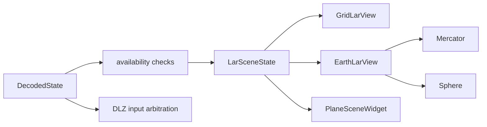

# Visualization guide

## Scope

The viewer presents one validated `LarSceneState` through five visual modes:
Grid, Mercator, Sphere, Plane, and DLZ. The first four consume the mapped
`Plane` and `Target` values; DLZ consumes an isolated three-field telemetry
envelope or its local calculation-test controls.

Presentation does not repair unavailable data. Every view receives the same
`DecodedState::availableFields` mask and draws only the geometry whose inputs
are present.

## Coordinate and unit model

| Concern | Coordinates | Units | Notes |
| --- | --- | --- | --- |
| Packet geography | latitude, longitude | radians | north/east positive; validated to WGS84 angular bounds |
| Packet altitude | model datum | metres | Plane terrain requires an MSL-compatible datum for absolute alignment |
| Packet attitude | yaw/heading, pitch, roll | radians | finite but not normalized by the decoder |
| Packet velocity | three producer axes | kilometres/hour | displayed as supplied |
| Grid | local east/north | metres | flat Euclidean presentation |
| Mercator map | longitude, projected latitude | degrees | longitude repeats every 360 degrees |
| Sphere | geographic latitude/longitude | degrees in map camera, radians in domain geometry | orthographic visible hemisphere |
| Plane scene | east `+X`, up `+Y`, north `-Z` | scene units derived from metres | aircraft remains at the origin |
| DLZ | NED state internally | metres, metres/second, radians | displayed ranges are nautical miles |

`LarGeodesicGeometry` uses a mean spherical Earth radius of 6,371,008.8
metres. That is a deliberate visualization model; it is not an ellipsoidal
geodesy or navigation solution.

## State-to-view pipeline



`ApplicationViewModel` publishes an atomic decoded state. `LarViewport`
forwards that state to the active content page and keeps the LAR projection and
camera selection when the user temporarily opens Plane or DLZ.

## LAR input definitions

`LarZoneInputValidator` translates mapped target fields into
projection-neutral definitions:

| Geometry | Required fields | Meaning |
| --- | --- | --- |
| In-range (IR) | `ir_pos[0]`, `ir_pos[1]`, `ir_r` | Full geodesic disk from zero to `ir_r` |
| In-zone (IZ) | `iz_pos[0]`, `iz_pos[1]`, `iz_theta1`, `iz_theta2`, `iz_r1`, `iz_r2` | Directed geodesic annular sector |

`ir_pos[2]` and `iz_pos[2]` remain protocol radius components for display;
the geographic LAR renderer uses the explicit `ir_r`, `iz_r1`, and
`iz_r2` fields. Each renderer rejects radii over 20,000 km before allocating
geometry.

The IZ span is the positive directed angle from `theta1` to `theta2`.
Equivalent full-circle input is normalized within a `1e-9` tolerance. An
invalid IR does not suppress an independently valid IZ, and vice versa; an
unavailable definition is simply absent.

## Grid view

Grid is a local tangent-style flat presentation:

- The first valid geographic coordinate establishes a stable origin.
- Latitude/longitude differences are converted to east/north metres with the
  origin-latitude longitude scale.
- Follow-plane, follow-target, and free movement are applied by
  `ViewportCameraController` and `GridCameraTransform`.
- The scale is pixels per metre and remains within camera bounds.
- Grid spacing is quantized to human-readable steps and the navigation overlay
  reports distance and direction.

Grid is intentionally not a globe. Large radii may be accepted within resource
limits, but a circle in Grid is Euclidean rather than a claim about a constant
surface distance on Earth.

## Earth map pipeline

Mercator and Sphere share one immutable `MapMesh` loaded from the packaged
`lar_world_map.larmap`. The mesh contains geographic vertices, separate flat
and spherical triangle indices, border indices, and a one-degree land-triangle
index. `EarthMapLoadController` loads it asynchronously once and rejects stale
revisions. GPU upload happens only after the result returns to the owning
OpenGL context.

The map compiler and package layout are documented in
[Terrain and asset pipeline](TERRAIN_AND_ASSETS.md).

## Mercator view

`MapCamera` stores flat-map x as longitude degrees and y as projected
Mercator degrees. The renderer:

- clamps latitude to the supported projection range;
- draws every periodic longitude copy intersecting the rotated viewport;
- splits or duplicates antimeridian geometry as required;
- keeps the camera center constrained to the available projected map;
- uses upper-left-origin screen pixels for input and hit testing.

Polar LAR geometry is built geodesically before projection. A footprint that
crosses a pole or the Mercator cutoff can continue along both map edges rather
than being shortened to a misleading local arc.

## Sphere view

Sphere uses orthographic projection. A valid geographic coordinate can project
successfully while being outside the viewport or on the back hemisphere; the
projection API reports visibility separately from input validity.

The tracked sphere center remains binary64 in `MapCamera`. For shader use it
is split into high and low float components and accompanied by precomputed
latitude sine/cosine. This avoids first rounding a close-zoom camera center to
one float and then subtracting nearby vertices from that lossy value.

## Geodesic zone accuracy and fallback

Earth zones have two OpenGL paths:

1. `LarParametricZoneGpuLayer` draws compact parameters through reusable
   topology when fixed tessellation and float-coordinate error are proven safe.
2. `ViewportPreparationWorker` builds camera-aware CPU geometry when the
   parametric proof fails, including polar and extreme-zoom cases.

Both paths honor the same projected curve-error target of **0.65 pixel**.
The CPU path adaptively chooses angular and radial sampling and uses
camera-relative coordinates for numerically sensitive cases.

Central CPU limits are:

| Resource | Limit |
| --- | ---: |
| Vertices per build | 12,000 |
| Indices per build | 48,000 |
| Angular subdivisions | 2,048 |
| Radial subdivisions | 48 |
| Fill cells per zone | 2,600 |
| Radius | 20,000,000 m |

The preparation worker is latest-only. A superseded request may finish CPU
work, but its revision cannot replace the active mesh. The UI/context thread
alone owns `LarZoneGpuLayer` buffers.

## Camera behavior

The three LAR camera modes share a single value model:

| Mode | Center | Bearing |
| --- | --- | --- |
| Follow plane | mapped aircraft latitude/longitude | north-up unless **Turn with plane** is enabled |
| Follow target | mapped IZ center | north-up |
| Free movement | current user-selected center | north-up |

Dragging converts a followed camera to free movement. Zoom anchors at the
tracked point when following and at the cursor in free mode. Fit-to-data uses
only available aircraft, IR, and IZ coordinates and does not change the
tracking-mode selection.

## Plane composition

Plane uses a native OpenGL scene with this conceptual order:

1. cubemap skybox;
2. DTED terrain, when selected and ready;
3. optional tactical grid and flat LAR overlays;
4. target marker;
5. aircraft model.

The terrain renderer performs separate land and water passes. When terrain is
selected but no patch is ready, it deliberately omits land-colored flat ground;
the skybox, aircraft, and independently selected tactical overlays can remain
visible.

### Aircraft transform and scale

`PlaneAttitudeTransform` converts protocol yaw, pitch, and roll into the
orientation of a model whose nose is `-Z`, right wing is `+X`, and up is
`+Y`. Missing attitude components produce the incomplete-attitude diagnostic
instead of reusing stale angles.

The model reader recenters a successful mesh and uniformly normalizes its
largest extent to two scene units. `PlaneAircraftScale` uses the model's
forward extent so the unchanged aircraft represents a 15 m F-16. Metric ground,
terrain, target, and zones expand around it; toggling those layers never
resizes the aircraft.

### Tactical surface

`PlaneSurfaceProjection` produces immutable draw state:

- a stable first-coordinate ground origin and grid phase;
- aircraft-relative target and zone centers;
- bounded grid spacing and surface extent;
- ground height from available altitude;
- a target pyramid sized to 0.5% of the preferred outer range, clamped to a
  3–25 m half-width.

The target uses IZ coordinates when present and falls back to IR coordinates.
IR and IZ definitions remain independently visible based on their own fields.
When terrain is ready, the target marker is placed at the sampled land or water
surface at its own coordinate rather than always using the center elevation.

### Orbit camera

`PlaneOrbitCamera` follows aircraft heading while retaining the user's orbit
offset. Its distance is bounded from 2.6 to 20,000,000 scene units and elevation
from -82° to +82°. Selecting terrain or the tactical surface raises the minimum
elevation to +3° so the camera cannot orbit beneath the ground presentation.

## Terrain alignment

Terrain vertices are sampled by inverting the exact local flat projection used
by tactical overlays. A cached patch retains its original reference-latitude
scale; placement compensates the east axis as the aircraft latitude changes.
This makes a target, shoreline, and terrain sample agree in the same local
coordinate model while a patch is reused.

Terrain details, cache behavior, and land/water classification are in
[Terrain and asset pipeline](TERRAIN_AND_ASSETS.md).

## DLZ presentation

DLZ does not reuse the ground-LAR `Target` ranges. A complete external triple
is adapted to an isolated NED teaching scenario, or the calculation-test
sliders provide all inputs. Both sources pass through the same solver and
presentation controller.

The presentation adds time-dependent filtering, range-scale hysteresis, and
SHOOT-cue hysteresis to otherwise deterministic equations. See
[DLZ model](DLZ_MODEL.md) for the exact domain and formulas.

## OpenGL lifecycle

Every OpenGL resource is created, uploaded, drawn, and destroyed while its
owning context is current:

- CPU workers publish immutable map/zone/terrain/model candidates.
- Widgets receive candidates on their affinity thread.
- `initializeGL` creates programs and static buffers.
- pending assets upload during a paint pass.
- `aboutToBeDestroyed` triggers context-current cleanup.

CPU validation tests cannot prove shader/compiler/driver behavior. The opt-in
Earth and Plane GPU tests therefore compile real shaders and inspect rendered
output on a native context.

## Verification map

| Behavior | Primary tests |
| --- | --- |
| Grid transforms and tracking | `larcamera-tests`, `larviewport-page-tests` |
| Geodesic limits and 0.65-pixel policy | `larzone-tests` |
| Polar/antimeridian UDP path | `larpolar-udp-tests` |
| Map loading and renderer validation | `larmap-loading-tests`, `larmap-renderer-validation-tests` |
| Earth native OpenGL | `lar-earth-view-gpu-tests` |
| Plane transforms, assets, terrain, land mask | `larplane-view-tests` |
| Plane native OpenGL | `lar-plane-view-gpu-tests` |
| DLZ domain and QWidget presentation | `lardlz-tests`, `lardlz-view-tests` |

Run native GPU tests only on a machine with an OpenGL-capable display:

```bash
LAR_RUN_MAP_GPU_TESTS=1 LAR_RUN_PLANE_GPU_TESTS=1 \
  ctest --test-dir build-release -R 'lar-(earth|plane)-view-gpu-tests' \
  --output-on-failure
```
